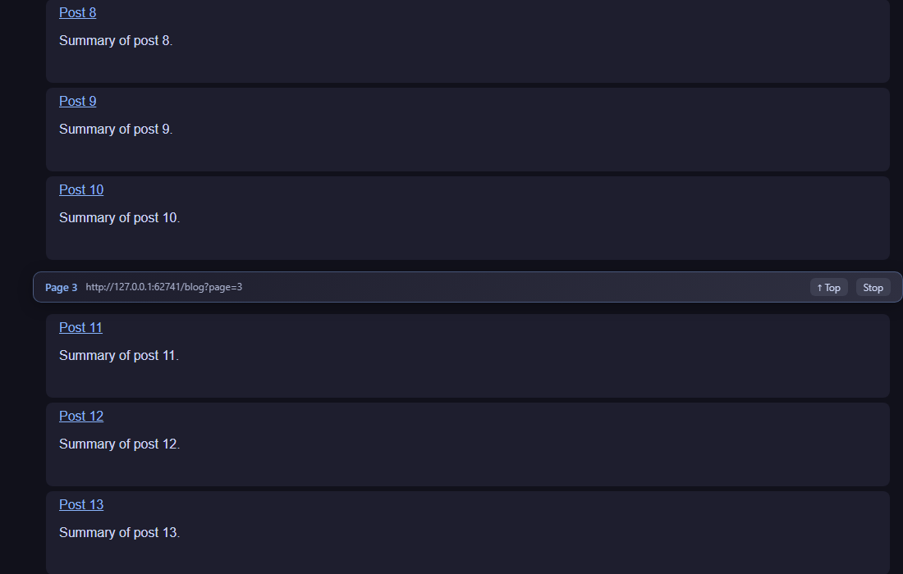
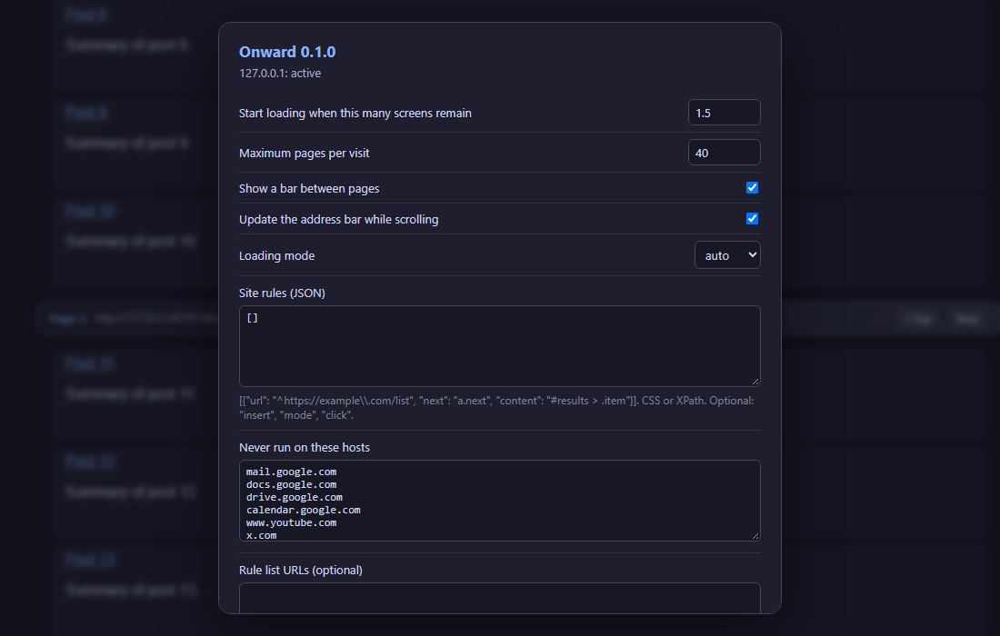

# Onward

[](https://github.com/SysAdminDoc/Onward_Userscript/releases)
[](LICENSE)
[](#install)

Onward is a small auto-pager userscript. When you reach the bottom of a paginated page (search results, forum threads, blog archives, shop listings) it finds the link to the next page, fetches it, and adds that page's results below the ones you're reading. You keep scrolling instead of clicking "Next".

It does the same job as [Pagetual](https://github.com/hoothin/UserScripts/tree/master/Pagetual) and AutoPagerize, but the whole thing is about 1,400 readable lines instead of 13,000. There's no rule database to download. Detection works from the page itself, and you can teach it a site in two clicks when it guesses wrong.



## Install

1. Install [Tampermonkey](https://www.tampermonkey.net/) or [Violentmonkey](https://violentmonkey.github.io/).
2. Open [`src/onward.user.js`](https://raw.githubusercontent.com/SysAdminDoc/Onward_Userscript/main/src/onward.user.js) and accept the install prompt.

The script updates itself from this repo.

## What it does

- **Finds the next page without rules.** It checks `<link rel="next">` first, then scores links and buttons by their label ("Next", "Older posts", 下一页, 次へ, 다음, Следующая and about 80 more), their classes, whether they sit in a pager, and whether the URL is the current `?page=N` or `/page/N/` plus one. Previous-page links, disabled items, carousels and sliders are ruled out. Numbered pagers work too: if page 3 is marked current, the link labelled 4 wins.
- **Finds the list to extend.** It looks for the element whose children repeat (results, posts, rows, cards) and covers the most of the screen, skipping headers, footers, menus and the pager itself. Interleaved rows like Hacker News' title and subtext lines stay together.
- **Adds only new content.** Items that repeat word for word from page 1 (sticky threads, "sort by" bars, headings) are dropped. If a site sends back a page it already sent, Onward stops.
- **Handles the awkward cases.** Lists rendered by JavaScript get loaded in a hidden iframe. "Load more" buttons get clicked. Pages that scroll inside a div instead of the window work. Non-UTF-8 pages (Shift_JIS, GBK, windows-1251) are decoded properly, and lazy-loaded images get their real `src`.
- **Survives React and friends.** If the site redraws its list and throws away the added pages, Onward switches to putting each page in its own copy of the list, which frameworks leave alone.
- **Stays out of the way on sites that already scroll forever.** Discourse and Flarum forums are left alone. On other sites Onward watches for a few seconds before its first page and whenever you reach the bottom. If the site adds items by itself, Onward takes its own pages back out and stands by.
- **Is polite to servers.** At most 40 pages per visit by default. A failed request pauses loading until you click Retry. If added pages don't make the page any longer, it stops rather than loading forever.

Each added page gets a slim bar with the page number, its URL, and buttons to jump to the top or stop. Once stopped, the bars offer Resume instead. As you scroll, the address bar follows the page you're reading, so refreshing or sharing the link lands in the right place.

## Menu commands

Open your userscript manager's menu on any page:

| Command | What it does |
| --- | --- |
| Toggle Onward on this site | Turns it off or back on for the current host. With "Run on: only sites I list", it adds the site to the list or takes it off. |
| Load next page now | Loads the next page without scrolling. It also resumes after you pressed Stop or after a failure, and tells you when the last page has been reached. |
| Load 5 more pages | Loads up to five pages one after another, handy for reading or printing a whole thread. It keeps to the page limit and the gap between requests. |
| Run Onward here anyway | Starts Onward on a page where it stood by because the site seemed to load more by itself. |
| Pick next link and content… | Click the "Next" link, then click one result. Onward saves a rule for the site and restarts. |
| Settings | Opens the settings panel. |



## Site rules

When automatic detection gets a site wrong, the picker is the quickest fix. You can also write rules by hand in Settings. A rule is a JSON object:

```json
[
  {
    "url": "^https://forum\\.example\\.com/threads/",
    "next": "a.pagination-next",
    "content": "#posts > .post",
    "insert": "",
    "mode": "fetch",
    "click": false
  }
]
```

- `url` is a regular expression matched against the page address.
- `next` and `content` accept CSS selectors or XPath (anything starting with `/`, `./`, `(` or `id(`).
- `insert` is optional. New pages go before the first element it matches.
- `mode` is `auto`, `fetch` or `iframe`. Use `iframe` for sites that build their lists with scripts.
- Set `click` to `true` when `next` is a button with no link, such as "Load more".
- `excludeUrl` is optional. The rule is skipped on addresses it matches.

A rule only takes over on pages where its selectors actually find something. On other pages of the same site, Onward falls back to finding the next page by itself.

Rule lists in AutoPagerize/wedata format (`url`, `nextLink`, `pageElement`, `insertBefore`) are understood too. Paste their URLs into "Rule list URLs" and Onward refreshes them weekly. Very broad patterns from those lists are skipped so they don't override detection.

## Settings

| Setting | Default | Notes |
| --- | --- | --- |
| Start loading when this many screens remain | 1.5 | Lower means later, higher means earlier. |
| Maximum pages per visit | 40 | A hard cap per page load. |
| Wait between page requests (ms) | 1000 | However fast you scroll, a site gets at most one page request per this many milliseconds. |
| Show a bar between pages | on | Status bars (loading, errors, end) always show. |
| Update the address bar while scrolling | on | Uses `history.replaceState`, so the back button isn't flooded. |
| Loading mode | auto | `auto` fetches first and falls back to an iframe when needed. |
| Run on | every site | "only sites I list" keeps Onward off everywhere except the sites below. |
| Sites to run on | empty | One host per line, used with "only sites I list". Subdomains are covered. |
| Stay off pages whose path matches | checkout, cart, sign-in, sign-up, account and password pages | A regular expression tested against the page's path, case-insensitive. Adding pages to a checkout or sign-in flow can break it. "Run Onward here anyway" still works on these pages. |
| Never run on these hosts | Gmail, Docs, YouTube, X, Facebook and a few more | One host per line. Subdomains are covered. |

## Development

```powershell
npm install
npm test          # detection unit tests (jsdom)
npm run e2e       # the real script in headless Chromium against a local fixture site
npm run check     # syntax check and version consistency
npm run screenshots
npm run smoke -- https://news.ycombinator.com/news
```

`npm run e2e` needs Playwright's Chromium (`npx playwright install chromium` if it isn't there). The fixture site in `test/e2e/site.js` covers a paginated blog, a windows-1252 forum table, a script-rendered grid, a list that redraws itself, a failing server, an inner scroll container and a load-more button.

The script is one file on purpose. It's wrapped in a small factory so the same code runs in the userscript manager and in Node tests without a build step.

## License

MIT. See [LICENSE](LICENSE).
